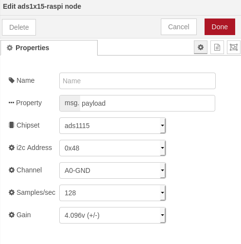
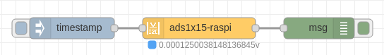
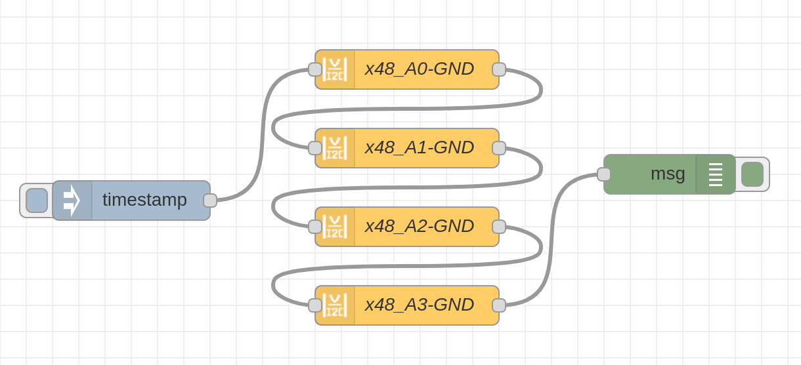
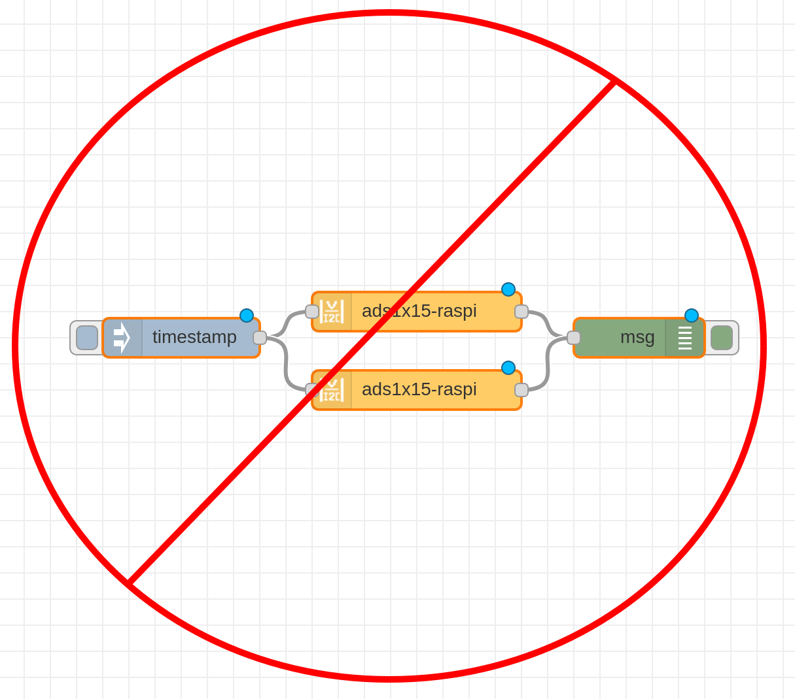

node-red-contrib-anolog-to-digital-converter-raspberry-pi
==================================


<a href="http://nodered.org" target="_new">Node-RED</a> A node-red node providing access to a ADS1x15 I2C analog to digital converter using a raspberry pi.

---

## Table of Contents
* [Install](#install)
* [Usage](#usage)
  * [Name](#Name)
  * [Property](#Property)
  * [Chipset](#Chipset)
  * [i2c_Address](#i2c_Address)
  * [Channel](#Channel)
  * [Samples](#Round_Output)
  * [Gain](#Gain)
* [Example Flows](#example-flows)
  * [Simple_Example](#simple_example)
  * [advance_example](#advance_example)
  * [treeing](#treeing)
  * [Dropped_Request](#Dropped_Request)
* [Bugs / Feature request](#bugs--feature-request)
* [License](#license)
* [Work](#work)
* [Contributor_of_Project](#Contributor_of_Project)

---

## Install

Install with node-red Palette Manager or,

Run the following command in your Node-RED user directory - typically `~/.node-red`:

```
npm install node-red-contrib-anolog-to-digital-converter-raspberry-pi
```


## Usage

To get a voltage or difference of voltage from a ADS1115 or ADS1015 analog to digital converter just select the correct setting for your device and trigger the node.




### Name

Define the msg name if you wish to change the name displayed on the node.

### Property

Define the msg property name you wish. The name you select (msg.example) will also be the output property</p>
The payload must be a number! Anything else will try to be parsed into a number and rejected if that fails.

### Chipset

The Chipset by default is set to 1115. The Chipset is the version of ads supported. If you have an ads1015 select that option.

### i2c_Address

The Address by default is set to 0x48. You can setup the ADS1X15 with one of four addresses, 0x48, 0x49, 0x4a, 0x4b. Please see ads1X15 documentation for more information

### Channel

The Channel may be used for Single-ended measurements (A0-GND) or Differential measurements (A0-A1). Single-ended measurements measure voltages relative to a shared reference point which is almost always the main units ground. Differential measurements are “floating”, meaning that it has no reference to ground. The measurement is taken as the voltage difference between the two wires. Example: The voltage of a battery can be taken by connecting A0 to one terminal and A1 to the other.

### Samples

Select the sample per second you want your ADS to make. Higher rate equals more samples taken before being averaged and sent back from the ADS. Please see ads1X15 documentation for more information

### Gain

I  Select the Gain you want. To increase accuracy of smaller voltage signals, the gain can be adjusted to a lower range. Do NOT input voltages higher than the range or device max voltage, pi 3.3v use a voltage devider to lover input voltages as needed.

## Example Flows

Examples showing how to use the voltage_undivider.


### simple_example



```
[{"id":"2cd25fcc.2e978","type":"inject","z":"95ed73ce.f4c49","name":"","topic":"","payload":"","payloadType":"date","repeat":"","crontab":"","once":false,"onceDelay":0.1,"x":380,"y":300,"wires":[["16a39eb9.adf799"]]},{"id":"16a39eb9.adf799","type":"ads1x15-raspi","z":"95ed73ce.f4c49","property":"ffff","name":"","chip":"IC_ADS1115","i2c_address":"ADDRESS_0x48","channel":"DIFF_1_3","samplesPerSecond":"SPS_250","progGainAmp":"PGA_4_096V","x":560,"y":300,"wires":[["1c612a9f.05f2f5"]]},{"id":"1c612a9f.05f2f5","type":"debug","z":"95ed73ce.f4c49","name":"","active":true,"tosidebar":true,"console":false,"tostatus":false,"complete":"true","targetType":"full","x":730,"y":300,"wires":[]}]
```

<br>

### advance_example


```
[{"id":"9fa062dc.6e1b6","type":"inject","z":"a074224d.a6b91","name":"","topic":"","payload":"","payloadType":"date","repeat":"","crontab":"","once":false,"onceDelay":0.1,"x":140,"y":240,"wires":[["2bfc185d.72ddd8"]]},{"id":"2bfc185d.72ddd8","type":"ads1x15-raspi","z":"a074224d.a6b91","property":"x48_A0-GND","name":"x48_A0-GND","chip":"IC_ADS1115","i2c_address":"ADDRESS_0x48","channel":"CHANNEL_0","samplesPerSecond":"SPS_250","progGainAmp":"PGA_4_096V","x":350,"y":140,"wires":[["e219cd74.4ea59"]]},{"id":"edb67462.6fbb88","type":"debug","z":"a074224d.a6b91","name":"","active":true,"tosidebar":true,"console":false,"tostatus":false,"complete":"true","targetType":"full","x":550,"y":220,"wires":[]},{"id":"e219cd74.4ea59","type":"ads1x15-raspi","z":"a074224d.a6b91","property":"x48_A1-GND","name":"x48_A1-GND","chip":"IC_ADS1115","i2c_address":"ADDRESS_0x48","channel":"CHANNEL_1","samplesPerSecond":"SPS_250","progGainAmp":"PGA_4_096V","x":350,"y":200,"wires":[["bc5b5300.34dc1"]]},{"id":"bc5b5300.34dc1","type":"ads1x15-raspi","z":"a074224d.a6b91","property":"x48_A2-GND","name":"x48_A2-GND","chip":"IC_ADS1115","i2c_address":"ADDRESS_0x48","channel":"CHANNEL_2","samplesPerSecond":"SPS_250","progGainAmp":"PGA_4_096V","x":350,"y":260,"wires":[["6a55c7a6.54e078"]]},{"id":"6a55c7a6.54e078","type":"ads1x15-raspi","z":"a074224d.a6b91","property":"x48_A3-GND","name":"x48_A3-GND","chip":"IC_ADS1115","i2c_address":"ADDRESS_0x48","channel":"CHANNEL_3","samplesPerSecond":"SPS_250","progGainAmp":"PGA_4_096V","x":350,"y":320,"wires":[["edb67462.6fbb88"]]}]
```
<br>
Please import this flow as an example of how to use.

NOTE: Make sure you name your msg.payload for each node or it will be deleted by the next. Again please import the example above.  

<br>

### treeing


<br>
<br>
This is supported but highly discouraged. A warning message will display when this method is used.
<br>
The ADS1X15 cannot process more than one task at a time. To support this a delay is added to each trigger and while loop is used to check when a slot is available. This adds overhead that is not needed if the user just daisy-chain the nodes and sets the msg.payload to a more appropriate name.
<br>
Please import and use the advance example above if you need direction.

<br>

### Dropped_Request

If you try to get more than one voltage reading in 100ms, from the same address, and channel, the node will drop the msg triggering the event.<br> To stop this error just lower the amount of trigger events your sending to the node.  


## Bugs / Feature request
Please [report](https://github.com/meeki007/node-red-contrib-ads1x15-raspi/issues) bugs and feel free to [ask](https://github.com/node-red-contrib-ads1x15-raspi/issues) for new features directly on GitHub.


## License
This project is licensed under [Apache 2.0](http://www.apache.org/licenses/LICENSE-2.0) license.


## Work
_Need a node?
_Need automation work?
_Need computers to flip switches?

Contact me at meeki007@gmail.com


## Contributor_of_Project

Thanks to [Kevin Fitzgerald AKA kfitzgerald](https://github.com/kfitzgerald/raspi-kit-ads1x15#readme) for his work on raspi-kit-ads1x15. It made making this node for node-red possible.
<br>
Thank you to Andre van Amerongen; took the time to let me know about multiple trigger / treeing issue.

## release notes ##
0.0.0 = (majorchange) . (new_feature) . (bugfix-simple_mod)

version 0.2.13
<br>
First Public release
<br>
<br>
version 0.3.13
<br>
Updated node to support the input event callback function, and add Backwards compatibility
<br>
more info found here: [https://nodered.org/blog/2019/09/20/node-done](https://nodered.org/blog/2019/09/20/node-done)
<br>
<br>
version 0.4.15
<br>
Bug fix: no error msg when treeing node / triggering multiple nodes at the same time
<br>
New feature: added Asynchronous Function to handle treeing<br>
Also added duplicate trigger drop on same msg triggering the same chip, address, and channel in less than 100ms
<br>
<br>
version 0.4.16
<br>
Updated Documentation
<br>
<br>
<br>
version 0.4.19
<br>
Added more verbose statment for faild connection to ADC. To tell user on what chip, address and channel.
<br>
Fixed chip selction being stuck and unable to select ads1015. No longer stuck on ADS1115 mode.
<br>
<br>
<br>
version 0.4.23
<br>
Fixed Samples Per second issue. Users unable to set and keep value wanted.
<br>
Fixed a timeout issue that crashed node-red proper. THIS WAS BAD. But a rare case if a user had 4 ADC's connected and polled them at a rate of less than 100ms. Thankyou odd balls. never thought people would go pushing the limits of this node.
<br>
<br>
<br>
version 0.4.24
<br>
Docker fix patch
<br>
<br>
<br>
<br>
version 0.4.25
<br>
Changed msg object to a better format
<br>
